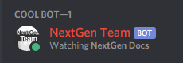

# Using Events

We already explored one event handler in [Set up your Bot,](../getting-started/set-up-your-bot.md) the `message` handler. Now let's take a look at some of the most important handlers that you will use, along with an example.


_**DO NOT NEST EVENTS**_ One important point: Do not nest any events \(aka "put one inside another"\). Ever. Events should be at the "root" level of your code, _beside_ the `message` handler and not within it.


## The `ready` event and its importance

Ah, asynchronous coding. So awesome. So hard to grasp when you first encounter it. The reality of discord.js and many, many other libraries you will encounter, is that code is not executed one line at a time, one after the other.

It should have been made obvious with the user of `client.on("message")` which triggers for each message. To explain how the `ready` event is important, let's look at the following code:

```javascript
const Discord = require("discord.js");
const client = new Discord.Client();
​
client.user.setActivity('NextGen Docs', { type: 'WATCHING' });
​
client.login("SuperSecretBotTokenHere");
```

This code will not work, because the client is not available immediately after it has been initialized. client.user will be indefinite in this case, even if we flip the console.log and login lines. This is because it takes a small amount of time for discord.js to load your servers, users, channels and all that stuff. The more servers the bot has, the longer it takes.

To ensure that the customer and all his "stuff" is ready, we can use the event ready. Any code you wish to execute at boot time that requires access to the client object must be in this case.

Here is a simple example of how to use the event manager ready:

```javascript
client.on("ready", () => { 

 client.user.setActivity('NextGen Docs', { type: 'WATCHING' });
 console.log(`Ready to serve on ${client.guilds.size} servers, for ${client.users.size} users.`);

 });
```



## GuildMemberAdd event

this event is for when a member enters your server you are alerted in a certain channel

```javascript
client.on("guildMemberAdd", (member) => {
  //variables
  var guild = member.guild
  var channel = guild.channels.cache.get(c => c.name === 'mod-logs')//Look for the channel in the guild and the send the message.
  //this are send on the console of the bot
  console.log(`New User "${member.user.username}" has joined "${member.guild.name}"` );
  //this will send the message to the channel with the name mod-logs
  channel.send(`"${member.user.username}" has joined this server`);

});
```

## GuildMemberRemove event

this event is for when a member leaves your server and is alerted on a specific channel

```javascript
client.on("guildMemberRemove", (member) => {
  //variables
  var guild = member.guild
  var channel = guild.channels.cache.get(c => c.name === 'mod-logs')//Look for the channel in the guild and the send the message.
  //this are send on the console of the bot
  console.log(`User "${member.user.username}" He's gone"${member.guild.name}"` );
  //this will send the message to the channel with the name mod-logs
  channel.send(`"${member.user.username}" he's left this server.`);

});
```

More events comming soon.. :D

