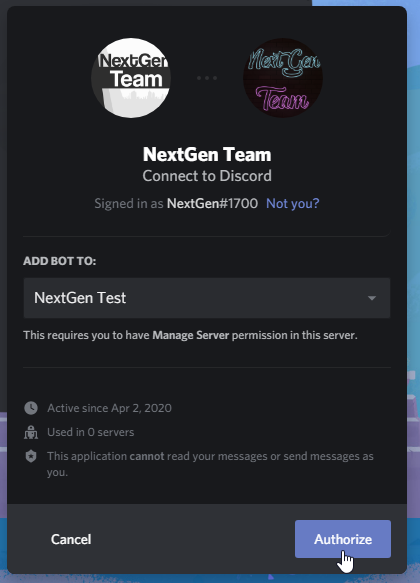

# Create your App and Bot account

## Creating your Discord App account

To create the application, go to the application page of [discordapp.com](https://discordapp.com/developers/applications/me) and log in, you will reach a page that looks like this:

Click on "New Application". This will take you to the next page, where you must enter a name for the application and an avatar/icon \(the application name will be for the initial bot\).

Now we go to the tab that says bot

And we click on the add bot button

Once we have thought of a creative name for our bot and then set a general picture of it, we proceed to save the changes and save some notes.

The first thing to note is your bot's token in the "Copy" section \(in the image highlighted in a red box\):


**WARNING:** Your bot's token is equivalent to an account's password and email address \(not yours\), so never share this code with anyone else but yourself who is not absolutely trustworthy as they may misuse the token.


Now we go back to the "General Information" tab where we get the id of your bot


**NOTE:** Your bot's client ID can be shared with other people, is not secret and is used to manipulate your bot's user address. All Discord users have an ID


Now that we have the bor id we go to the **"OAuth2"** tab where we will get the invitation from the bot and in this section we click on the little square that says **"bot"**


Note: If you want to generate a link by setting the permissions you want your bot to have inside a server, go to the section below called **"BOT PERMISSIONS"** and select the permissions you want it to have.


Click on the **"Copy"** button and then use this link in your browser!

Now you only have to select the server and you have created the application.

## Important Notes

* Remember to write down your bot's token, it will help you when you start programming your bot.
* The customer ID is completely public, you can share it without fear. \(Don't share the token!\)

