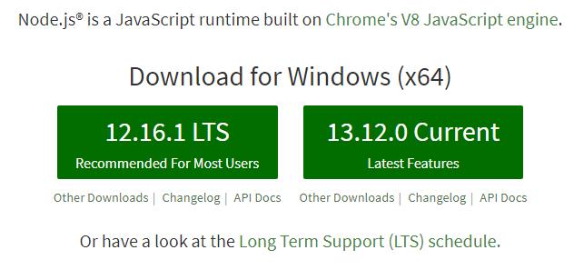
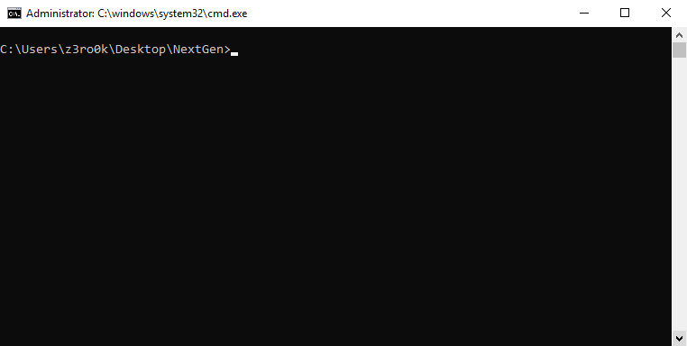
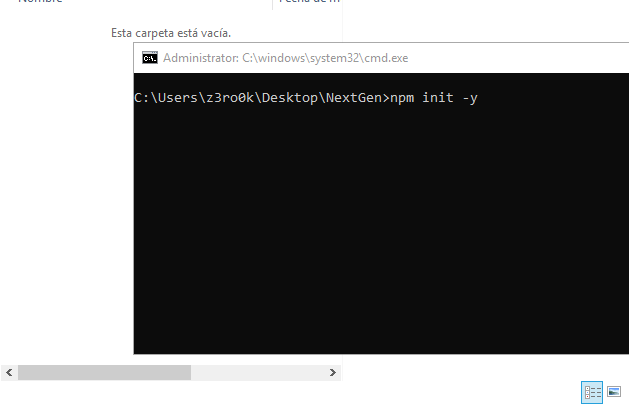
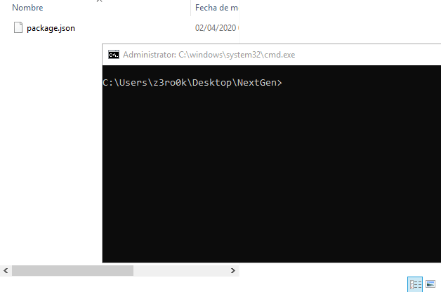

# Installing Discord.js and Node.js

To use discord.js and start programming you will need a couple of things installed. At least, at least:

* Node.js v8 or higher \(earlier versions are not supported\).
* Get a real code editor. Don't use the notepad, it's not enough. If you do not have a code editor installed go to [Installing a code editor](https://logicdevelopment.gitbook.io/guide/~/edit/drafts/-LIjcwWX-vtS__ACNj3s/installing-discord.js-and-node.js)

## Installing Node.js

Node is a JavaScript runtime environment, using an event-driven, non-locking I/O operations model, which makes it light and efficient.

Well to install Node, we'll go to the following link [Node.js download.](https://nodejs.org/en/)

 Download the recommended version and install it on your PC


**Note:** If you notice that node.js is not installed restart your pc


## Preparing the bot folder

Once you have the required software, the next step is to prepare a space for your code.

* Create a folder on the desktop or on a hard drive or partition
* Give the folder a name \(e.g. Bot, NextGen-Bot, etc.\)
* Once you have created a folder, open the console \(command line interface\) in that folder.

If you were unable to open the console, follow these steps:

* Press the windows key \(⊞ Win\) + R and type cmd to open the console.
* Once inside the console type the following: "cd desktop/NextGen" \(NextGen is the name of the folder\).

## Installing Discord.js

Once inside the console with the folder path, we will install Discord.js.

But first we will initialize this folder with NPM, this will ensure that any other modules installed are installed inside the folder.

To install, type "npm init -y" and then press enter inside the console.

A new file called "package.json" will be created, if you want to know more information about package.json [click here](https://docs.npmjs.com/files/package.json).

And now we install Discord.js through NPM, the Node Package Manager:

Type "npm i discord.js --save" in the console to install discord.js

The installation is very fast and will show a lot of things on the console screen. Unless you have a big red message that says "not found", or the package.json not found.

Once the installation of Discord.js is complete, we look in the folder and you will notice that there is a new folder created called "node\_modules". This contains all the packages installed for your project.

