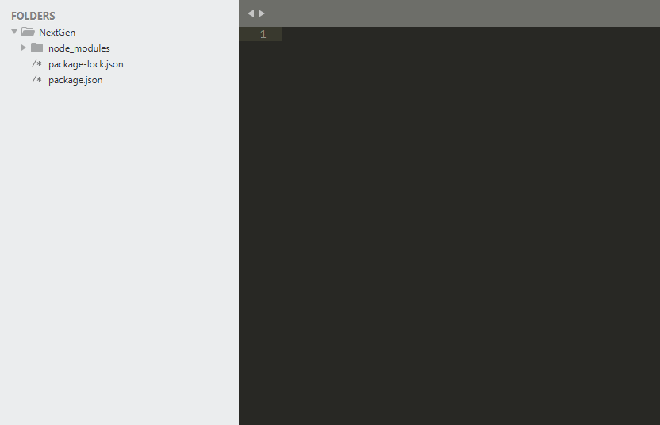
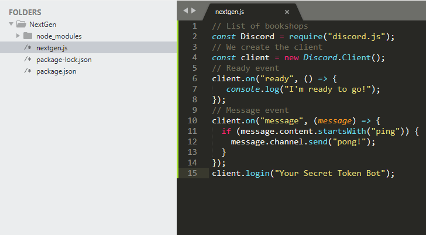
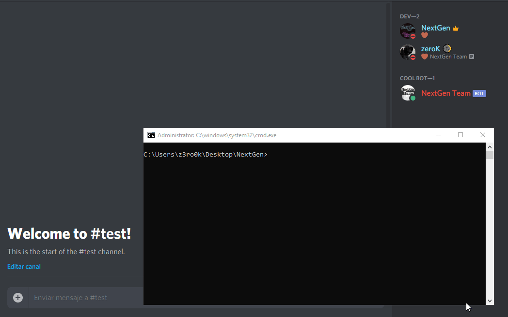

# Set up your bot


**NOTE:** It is assumed that you have followed the introductory chapter, creation and installation of your bot, before proceeding with this chapter. Also you are about to see JS\(Javascript\) code, if you do not understand or have no knowledge of JavaScript go to[ CodeAcademy](https://www.codecademy.com/learn/javascript) and learn the basics of Javascript.


## Let's get started:

* Open the bot folder with Sublime Text 3 or the editor you have installed.
* Create a new file and name it with the.js extension \(JavaScript file\).
* Examples: nextgen.js, index.js, app.js, etc.



Once the file is created, copy and paste the sample code to start a bot:

```javascript
//list of bookshops 
const Discord = require("discord.js");
//We create the client
const client = new Discord.Client();
//ready event
client.on("ready", () => {
   console.log("I'm ready to go!");
});
//messageevent
client.on("message", (message) => {
  if (message.content.startsWith("ping")) {
    message.channel.send("pong!");
  }
});
client.login("Your Secret Token Bot");     
```

Ok, now replace the line of the "client.login\('Your Secret Token Bot'\)" function with your previously created bot token.



And save everything using _\(CONTROL + S\)._

## Variables Used

| **Name** | **Description** |
| :--- | :--- |
| Discord |    Defined to reference the discord.js package/module. |
|   client        | It represents the .Client\(\) class; it is the main axis for interacting with the Discord API, and the starting point for any bot. |


**NOTE:** The variable "client" in some other examples or tutorials is called "bot", but technically it can be called in many ways. It is mostly called "client" to reference the function of .Client\(\);


Done, once the code is copied and the token is replaced it is time to activate the bot.

The way to activate a bot is by windows CMD console

* Open the console and enter the path to the bot folder.
* Type the following command inside the console: node nextgen.js \(nextgen.js is the name of the.js file\).



Ready you have a bot running now you can create a lot of functions for your bot

