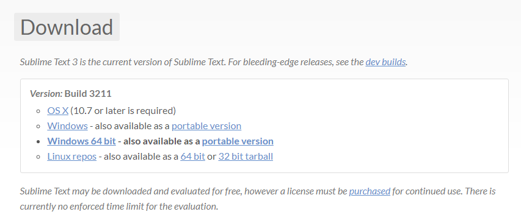

# Installing a code editor

## Sublime Text 2 or 3?

I wanted to highlight some of the changes from Sublime Text 2 here, however it's surprisingly hard: virtually every aspect of the editor has been improved in some way, and even a list of the major changes would be too long. If you'd like to see the full list of changes, the team has made a dedicated page for them.

Certainly there are big features that 3.0 has: Goto Definition, a new syntax highlighting engine, a new UI, and an expanded API. However the difference is frequently felt in the hundreds of improvements that don't warrant being featured on their own: spell checking works better, automatic indentation does the right thing more often, word wrapping handles source code better, high DPI screens are properly supported, and Goto Anything is smarter. There's too much to list, but combined the difference is night and day.

One of the areas I'm especially proud of in Sublime Text 3 is performance: it's significantly faster than Sublime Text 2 along every axis. Startup is faster, opening files is faster, and scrolling is more efficient. While it's a much larger application than 2, it feels leaner.

> #### So you decide which one you'll use for me. I'll use the Sublime Text 3.0 code editor.

## How to install Sublime Text 3

* enter the website [Sublime Text](https://www.sublimetext.com/3)
* Download the version that fits your PC: 

* **Once downloaded, run the Sublime Text Build 3211 x64 Setup.exe installer, this will only take a few minutes.**

> Note: I have Sublime Text Build 3211 x64 Setup.exe for the version I downloaded and the bits of my pc

## Using Sublime Text 3

Sublime Text 3 starts with a simple interface with a nice screen. You have the ability to open a project folder so you don't have to open the files individually anymore.

* Open Sublime Text 3
* Go to File, Open folder.

* Locate the main folder and click Select Folder \(Your files will not appear, only the folder structure\)
* To the left of the editor you will see all the files. Simply double-click on any of them to view and start editing.

## Other code editors

There are many other alternatives to edit your code, this is a small list. You will need to find specific instructions for these editors on your own

* [Notepad++](https://notepad-plus-plus.org/download/v7.4.2.html)
* [Brackets](http://brackets.io/)
* [Visual Studio Code](https://code.visualstudio.com)
* [Atom](https://atom.io/)

> Note: Don't use the notepad

