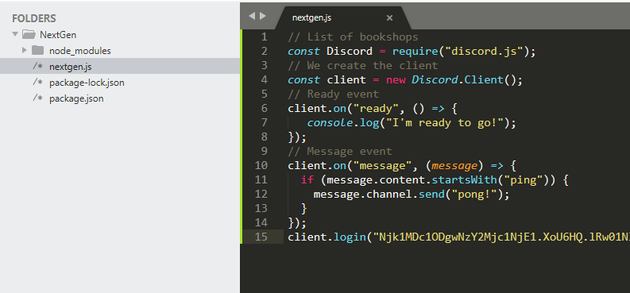
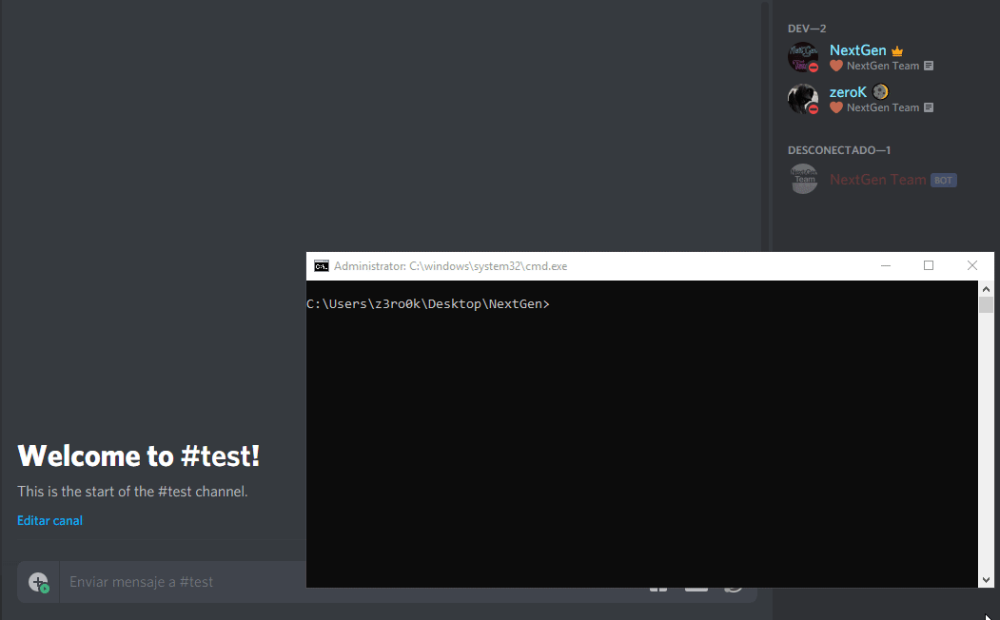

# Using a config.js file

You can notice that most bots respond using their prefix , Whether it is an exclamation mark \(!\), a period \(.\), a question mark \(?\) or another character. This is useful for two things.

If you don't use a unique prefix and have more than one bot on your server both will respond to the same commands.

Secondly, in the above example the bot responds when the message begins with ping which is 4 characters, this means that the next sentence will trigger the bot's response.

To avoid this we will create a prefix, as well as the ability to change the prefix whenever you like from one place.

Well, there are two ways to create and use a variable as a prefix:

1. Creating a variable within the same nextgen.js file as a prefix.
2. Divide the configuration of variables into parts, creating a.js file.

## Create the config.js file in your bot

* Create a new file inside the bot folder.
* and give it the name config.js. \(.js is the file extension\)



Now that we have created the configuration file there are 3 things we can add to the file, they are:

* The bot token
* The prefix
* Owner ID
* Among other things.

Copy and paste the following example into the.js configuration file.

```javascript
module.exports = {

    token: "Your Bot Token",

    Prefix: "/",

    owner: "Your ID of Discord"
}
```

After copying the config code you can change the prefix to which it looks best for the example I will use the symbol "/" as prefix

Save the change using \(CONTROL + S\).

## Prefix and token variable

At the top of your bot nextgen.js file, we added a line to call the config.js file using a variable.

```javascript
const Discord = require("discord.js");
const  client = new Discord.Client();
//ADD THE FOLLOWING CONFIG LINE TO THE BOT FILE
const { Prefix, token }= require("./config.js");
```

## Using the config file in your code

We are going to use the config variable that represents the configuration file, first we change the token by calling the variable directly.

Our bot line looks like this:

```javascript
client.login("Your Bot Token");
```

and simply add the token variable

```javascript
client.login(token);
```

Done, the other line we have to add is the prefix, we go to the line of our code and add the prefix by creating a new variable for the commands. After adding the prefix to the commands this should look like this:

```javascript
const Discord = require('discord.js');

const client = new Discord.Client();

const { Prefix, token }= require("./config.js");

client.on("ready", () => {
    console.log("i'm ready")
});

var prefix = Prefix

client.on("message", (msg) => {
    if (msg.content.startsWith(prefix + "ping")) {
    msg.channel.send("Pong!");
  }
  if (msg.content.startsWith(prefix + "hi")) {
    msg.channel.send("Hi <@" + msg.author + ">");
  }
});

client.login(token);
```


NOTE: I have created a new "hi" command and the bot will simply answer with a: Hi @Yourname\#0000, but this time you must use the prefix created.


Let's activate the bot again and check the changes with the prefix.




Great, the bot answers queries through the prefix created.


## Infinite Loop Prevention

There is one last thing I want to talk about: bots are answered? yes! and this is because if you have 2 bots with the same prefix on your server and each one must respond to the command of the same prefix, "/help". Now if a person writes /help on a channel and both bots respond, and a bot will see the answer as a query and will be answered at every moment. This is called an infinite loop: "repeat the same query without stopping."

to prevent this from happening, we must add two conditions within our code, at the beginning of the event \(message\) :

```javascript
 if (!message.content.startsWith(prefix)) return;
 if (message.author.bot) return;
```

The final bot code should look like this:

```javascript
const Discord = require('discord.js');

const Client = new Discord.Client();

const { Prefix, token }= require("./config.js");

Client.on("ready", () => {
    console.log("i'm ready")
});

var prefix = Prefix

client.on("message", (msg) => {

    if (!msg.content.startsWith(prefix)) return;
    if (msg.author.bot) return;

    if (msg.content.startsWith(prefix + "ping")) {
         msg.channel.send("Pong!");
    }

    if (msg.content.startsWith(prefix + "hi")) {
        msg.channel.send("Hi <@" + msg.author + ">");
    }

});

client.login(token);
```


And ready now has a basic and functional bot that responds to 2 commands


